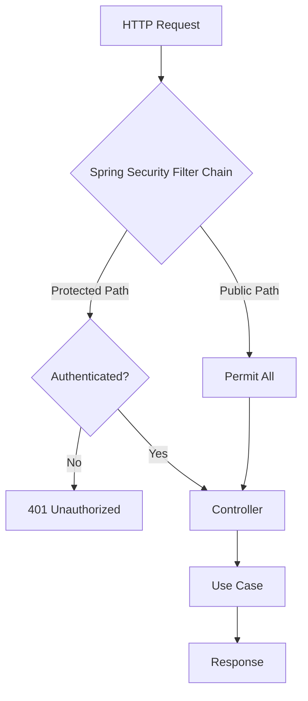

# Centralize Authentication Plan

## Current State Analysis

### Issues with Current Approach

1. **Manual Authentication Check in ThumbnailController** (lines 29-31)
   - Duplicates Spring Security's responsibility
   - Violates DRY principle
   - Error-prone: easy to forget in new controllers
   - Inconsistent: other controllers don't have this check

2. **Inconsistent Security Enforcement**
   - [`ThumbnailController`](src/main/java/com/fde/google_drive_organizer/adapter/inbound/http/ThumbnailController.java:29-31): Manual check
   - [`FileListController`](src/main/java/com/fde/google_drive_organizer/adapter/inbound/http/FileListController.java:30): Null check on OAuth2User
   - [`HomeController`](src/main/java/com/fde/google_drive_organizer/adapter/inbound/http/HomeController.java): No explicit check

3. **SecurityConfig Already Configured**
   - [`SecurityConfig`](src/main/java/com/fde/google_drive_organizer/adapter/inbound/http/config/SecurityConfig.java:16) has `.anyRequest().authenticated()`
   - This should already protect all endpoints except those explicitly permitted
   - Manual checks are redundant

## Recommended Solution: Spring Security Configuration

### Why Spring Security Configuration is Better Than Interceptors/Filters

**Spring Security is already in use** and provides:
- Declarative security at the configuration level
- Built-in OAuth2 integration
- Proper HTTP status codes (401 Unauthorized)
- Exception handling for authentication failures
- Integration with Spring's security context

**Custom Interceptors/Filters would:**
- Duplicate Spring Security functionality
- Require more code and maintenance
- Potentially conflict with Spring Security
- Not integrate as well with OAuth2

### Architecture Decision

**Use Spring Security's `HttpSecurity` configuration** to centralize authentication enforcement.



## Implementation Plan

### 1. Update SecurityConfig

**Current Configuration:**
```java
.authorizeHttpRequests(authorize -> authorize
    .requestMatchers("/", "/webjars/**", "/css/**", "/js/**", "/images/**", "/resources/**").permitAll()
    .anyRequest().authenticated()
)
```

**Enhanced Configuration:**
```java
.authorizeHttpRequests(authorize -> authorize
    // Public resources
    .requestMatchers("/", "/webjars/**", "/css/**", "/js/**", "/images/**", "/resources/**").permitAll()
    // API endpoints require authentication
    .requestMatchers("/api/**").authenticated()
    // All other requests require authentication
    .anyRequest().authenticated()
)
```

**Why this works:**
- Explicitly declares `/api/**` requires authentication
- Spring Security automatically returns 401 for unauthenticated requests
- No manual checks needed in controllers

### 2. Remove Manual Authentication Checks

**ThumbnailController - BEFORE:**
```java
@GetMapping("/{fileId}")
public ResponseEntity<byte[]> getThumbnail(@PathVariable String fileId, Authentication authentication) {
    if (authentication == null || !authentication.isAuthenticated()) {
        return ResponseEntity.status(HttpStatus.UNAUTHORIZED).build();
    }
    // ... rest of method
}
```

**ThumbnailController - AFTER:**
```java
@GetMapping("/{fileId}")
public ResponseEntity<byte[]> getThumbnail(@PathVariable String fileId) {
    // Authentication is guaranteed by Spring Security
    Optional<byte[]> thumbnail = getThumbnailUC.execute(fileId);
    // ... rest of method
}
```

**Benefits:**
- Cleaner controller code
- Single responsibility: controller handles HTTP, Security handles auth
- Consistent across all controllers
- Cannot forget to add authentication check

### 3. Optional: Add Custom Authentication Entry Point

For better API responses, optionally add a custom entry point:

```java
@Bean
public AuthenticationEntryPoint authenticationEntryPoint() {
    return (request, response, authException) -> {
        response.setStatus(HttpServletResponse.SC_UNAUTHORIZED);
        response.setContentType(MediaType.APPLICATION_JSON_VALUE);
        response.getWriter().write("{\"error\":\"Unauthorized\",\"message\":\"Authentication required\"}");
    };
}
```

Then configure it:
```java
.exceptionHandling(exception -> exception
    .authenticationEntryPoint(authenticationEntryPoint())
)
```

### 4. Handle Mixed Content (HTML + API)

**Current Endpoints:**
- `/` - HTML page (public)
- `/api/files` - Returns HTML fragment (requires auth)
- `/api/thumbnails/{fileId}` - Returns binary data (requires auth)

**Strategy:**
- Keep `/` public for initial page load
- Protect all `/api/**` endpoints
- OAuth2 login redirects unauthenticated users
- API endpoints return 401 for AJAX requests

### 5. Update Controller Tests

**Current Test Approach:**
Tests manually pass `Authentication` parameter and verify behavior.

**New Test Approach:**
Use Spring Security Test support:

```java
@WebMvcTest(ThumbnailController.class)
class ThumbnailControllerTest {
    
    @Test
    @WithMockUser  // Simulates authenticated user
    void shouldReturnThumbnailWhenAuthenticated() {
        // Test with authentication
    }
    
    @Test
    void shouldReturn401WhenNotAuthenticated() {
        // Test without @WithMockUser
        mockMvc.perform(get("/api/thumbnails/123"))
            .andExpect(status().isUnauthorized());
    }
}
```

## Alternative Approaches Considered

### Option 1: Custom HandlerInterceptor
```java
public class AuthenticationInterceptor implements HandlerInterceptor {
    @Override
    public boolean preHandle(HttpServletRequest request, HttpServletResponse response, Object handler) {
        Authentication auth = SecurityContextHolder.getContext().getAuthentication();
        if (auth == null || !auth.isAuthenticated()) {
            response.setStatus(HttpServletResponse.SC_UNAUTHORIZED);
            return false;
        }
        return true;
    }
}
```

**Rejected because:**
- Duplicates Spring Security functionality
- Requires additional configuration
- Less integration with OAuth2
- More code to maintain

### Option 2: Custom Filter
```java
public class AuthenticationFilter extends OncePerRequestFilter {
    @Override
    protected void doFilterInternal(HttpServletRequest request, HttpServletResponse response, FilterChain filterChain) {
        // Check authentication
    }
}
```

**Rejected because:**
- Spring Security already has a filter chain
- Would need to be ordered correctly
- Potential conflicts with existing security filters
- Unnecessary complexity

### Option 3: Method-Level Security with @PreAuthorize
```java
@PreAuthorize("isAuthenticated()")
@GetMapping("/{fileId}")
public ResponseEntity<byte[]> getThumbnail(@PathVariable String fileId) {
    // ...
}
```

**Rejected because:**
- Requires `@EnableMethodSecurity`
- Still requires annotation on every method
- Configuration-based approach is cleaner
- Less flexible for path-based rules

## Recommended Solution Summary

**Use Spring Security's `HttpSecurity` configuration** because:
1. ✅ Already in use in the project
2. ✅ Centralized in one place ([`SecurityConfig`](src/main/java/com/fde/google_drive_organizer/adapter/inbound/http/config/SecurityConfig.java))
3. ✅ Declarative and easy to understand
4. ✅ Proper integration with OAuth2
5. ✅ No code changes needed in controllers (just removal)
6. ✅ Consistent behavior across all endpoints
7. ✅ Standard Spring Security approach

## Implementation Steps

1. **Update SecurityConfig**
   - Make `/api/**` pattern explicit
   - Optionally add custom authentication entry point
   - Add exception handling configuration

2. **Refactor ThumbnailController**
   - Remove `Authentication` parameter
   - Remove manual authentication check
   - Simplify method signature

3. **Review FileListController**
   - Current null check on `OAuth2User` is fine for conditional logic
   - Not a security check, but a feature toggle
   - Keep as-is since it handles graceful degradation

4. **Add Integration Tests**
   - Test that `/api/thumbnails/{id}` returns 401 when not authenticated
   - Test that `/api/thumbnails/{id}` returns 200/404 when authenticated
   - Test that `/api/files` returns 401 when not authenticated

5. **Update Unit Tests**
   - Use `@WithMockUser` for authenticated tests
   - Remove manual `Authentication` parameter mocking
   - Add tests without `@WithMockUser` for 401 scenarios

## Benefits of This Approach

### Clean Architecture Compliance
- **Adapters layer**: Controllers focus on HTTP concerns only
- **Application layer**: Use cases remain authentication-agnostic
- **Domain layer**: Pure business logic, no security concerns

### Maintainability
- Single source of truth for security rules
- Easy to add new protected endpoints
- Consistent behavior across application

### Testability
- Clear separation of concerns
- Easy to test with Spring Security Test
- No need to mock authentication in every test

### Security
- Centralized security configuration
- Harder to accidentally expose endpoints
- Standard Spring Security patterns

## Migration Path

1. Update [`SecurityConfig`](src/main/java/com/fde/google_drive_organizer/adapter/inbound/http/config/SecurityConfig.java)
2. Update [`ThumbnailController`](src/main/java/com/fde/google_drive_organizer/adapter/inbound/http/ThumbnailController.java)
3. Update [`ThumbnailControllerTest`](src/test/java/com/fde/google_drive_organizer/adapter/inbound/http/ThumbnailControllerTest.java)
4. Add integration test for authentication enforcement
5. Verify all endpoints work correctly
6. Remove unused imports

## Conclusion

The manual authentication check in [`ThumbnailController`](src/main/java/com/fde/google_drive_organizer/adapter/inbound/http/ThumbnailController.java:29-31) is redundant and should be removed. Spring Security's configuration-based approach provides a cleaner, more maintainable, and more secure solution that aligns with Clean Architecture principles and Spring best practices.
