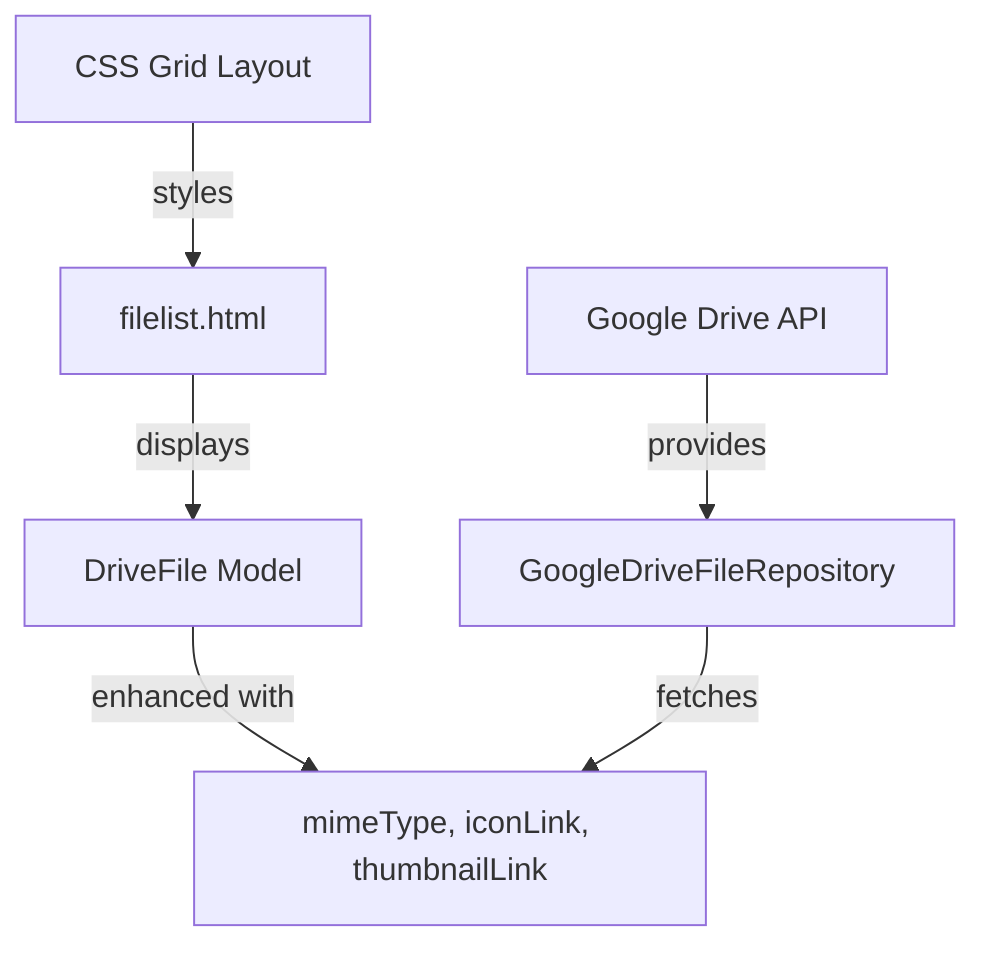

# File Grid Card Layout Plan

## Overview
Transform the current bullet-point file list into a Google Drive-style grid layout with cards. Each card will display file information in an `<article>` element with header, body, and footer sections.

## Current State Analysis

### Current Implementation
- **Template**: [`filelist.html`](src/main/resources/templates/fragments/filelist.html) displays files as a simple `<ul>` list
- **Domain Model**: [`DriveFile`](src/main/java/com/fde/google_drive_organizer/domain/model/DriveFile.java) only contains `id` and `name`
- **Data Fetching**: [`GoogleDriveFileRepository`](src/main/java/com/fde/google_drive_organizer/adapter/outbound/drive/GoogleDriveFileRepository.java) fetches only `id` and `name` fields (line 48)
- **Styling**: Uses Pico CSS framework

### Limitations
- No file type information (mimeType)
- No file icons (iconLink)
- No file thumbnails (thumbnailLink)
- Simple list layout instead of grid

## Proposed Solution

### Architecture Overview



### Component Changes

#### 1. Domain Layer Changes

**File**: [`DriveFile.java`](src/main/java/com/fde/google_drive_organizer/domain/model/DriveFile.java)

**Current**:
```java
public record DriveFile(String id, String name)
```

**Enhanced**:
```java
public record DriveFile(
    String id, 
    String name, 
    String mimeType, 
    String iconLink, 
    String thumbnailLink
)
```

**Rationale**: 
- `mimeType`: Identifies file type for proper icon display
- `iconLink`: Google-provided icon URL for file type
- `thumbnailLink`: Preview image for supported file types
- All fields nullable except `id` and `name` to handle files without thumbnails

#### 2. Adapter Layer Changes

**File**: [`GoogleDriveFileRepository.java`](src/main/java/com/fde/google_drive_organizer/adapter/outbound/drive/GoogleDriveFileRepository.java:48)

**Current API Call**:
```java
.setFields("files(id, name)")
```

**Enhanced API Call**:
```java
.setFields("files(id, name, mimeType, iconLink, thumbnailLink)")
```

**Mapping Logic**:
```java
.map(file -> new DriveFile(
    file.getId(), 
    file.getName(),
    file.getMimeType(),
    file.getIconLink(),
    file.getThumbnailLink()
))
```

#### 3. Presentation Layer Changes

**File**: [`filelist.html`](src/main/resources/templates/fragments/filelist.html)

**Current Structure**:
```html
<ul>
    <li th:each="file : ${driveFiles}" th:text="${file.name()}"></li>
</ul>
```

**Enhanced Structure**:
```html
<div class="file-grid">
    <article class="file-card" th:each="file : ${driveFiles}">
        <header>
            
            <span th:text="${file.name()}" class="file-name"></span>
        </header>
        <div class="file-preview">
            
            <div th:unless="${file.thumbnailLink()}" class="no-preview">
                
            </div>
        </div>
        <footer>
            <button type="button" class="archive-btn">Archive</button>
        </footer>
    </article>
</div>
```

#### 4. Styling Changes

**New File**: `src/main/resources/static/css/file-grid.css`

**Grid Layout**:
```css
.file-grid {
    display: grid;
    grid-template-columns: repeat(auto-fill, minmax(200px, 1fr));
    gap: 1rem;
    padding: 1rem 0;
}

.file-card {
    border: 1px solid var(--pico-muted-border-color);
    border-radius: var(--pico-border-radius);
    overflow: hidden;
    transition: box-shadow 0.2s;
    cursor: pointer;
}

.file-card:hover {
    box-shadow: 0 4px 8px rgba(0, 0, 0, 0.1);
}

.file-card header {
    display: flex;
    align-items: center;
    gap: 0.5rem;
    padding: 0.75rem;
    border-bottom: 1px solid var(--pico-muted-border-color);
}

.file-icon {
    width: 20px;
    height: 20px;
}

.file-name {
    flex: 1;
    overflow: hidden;
    text-overflow: ellipsis;
    white-space: nowrap;
    font-size: 0.9rem;
}

.file-preview {
    aspect-ratio: 1;
    display: flex;
    align-items: center;
    justify-content: center;
    background-color: var(--pico-background-color);
    overflow: hidden;
}

.thumbnail {
    width: 100%;
    height: 100%;
    object-fit: cover;
}

.no-preview {
    display: flex;
    align-items: center;
    justify-content: center;
    height: 100%;
}

.large-icon {
    width: 64px;
    height: 64px;
    opacity: 0.5;
}

.file-card footer {
    padding: 0.75rem;
    border-top: 1px solid var(--pico-muted-border-color);
}

.archive-btn {
    width: 100%;
    margin: 0;
    padding: 0.5rem;
    font-size: 0.85rem;
}
```

**Responsive Design**:
```css
@media (max-width: 768px) {
    .file-grid {
        grid-template-columns: repeat(auto-fill, minmax(150px, 1fr));
        gap: 0.75rem;
    }
}

@media (max-width: 480px) {
    .file-grid {
        grid-template-columns: repeat(auto-fill, minmax(120px, 1fr));
        gap: 0.5rem;
    }
}
```

#### 5. Template Integration

**File**: [`index.html`](src/main/resources/templates/index.html:6)

Add CSS import in `<head>`:
```html
<link rel="stylesheet" href="/css/file-grid.css">
```

### Testing Strategy

#### Unit Tests to Update

1. **[`DriveFileTest.java`](src/test/java/com/fde/google_drive_organizer/domain/model/DriveFileTest.java)**
   - Add tests for new fields validation
   - Test nullable fields (mimeType, iconLink, thumbnailLink)
   - Test non-nullable fields (id, name)

2. **[`DriveFileTestFixture.java`](src/test/java/com/fde/google_drive_organizer/domain/model/DriveFileTestFixture.java)**
   - Update builder to include new fields
   - Provide sensible defaults for test data

3. **[`GoogleDriveFileRepositoryTest.java`](src/test/java/com/fde/google_drive_organizer/adapter/outbound/drive/GoogleDriveFileRepositoryTest.java)**
   - Update mock responses to include new fields
   - Verify correct field mapping

4. **[`ListDriveFilesUCTest.java`](src/test/java/com/fde/google_drive_organizer/application/usecase/ListDriveFilesUCTest.java)**
   - Update to work with enhanced DriveFile model

### Implementation Steps

1. **Enhance Domain Model**
   - Update [`DriveFile`](src/main/java/com/fde/google_drive_organizer/domain/model/DriveFile.java) record with new fields
   - Add validation for nullable fields

2. **Update Repository**
   - Modify [`GoogleDriveFileRepository`](src/main/java/com/fde/google_drive_organizer/adapter/outbound/drive/GoogleDriveFileRepository.java) to fetch additional fields
   - Update mapping logic

3. **Update Port Interface**
   - Ensure [`FileRepository`](src/main/java/com/fde/google_drive_organizer/domain/port/outbound/FileRepository.java) interface is compatible

4. **Update Test Fixtures**
   - Enhance [`DriveFileTestFixture`](src/test/java/com/fde/google_drive_organizer/domain/model/DriveFileTestFixture.java)
   - Update all test files

5. **Create Styles**
   - Create `src/main/resources/static/css/file-grid.css`
   - Add responsive breakpoints

6. **Update Template**
   - Redesign [`filelist.html`](src/main/resources/templates/fragments/filelist.html) with card layout
   - Add CSS import to [`index.html`](src/main/resources/templates/index.html)

7. **Manual Testing**
   - Verify grid layout renders correctly
   - Test responsive behavior
   - Verify file icons and thumbnails display
   - Test "Propose Folder" button appearance

### Edge Cases to Handle

1. **Files without thumbnails**: Display large icon instead
2. **Long file names**: Use text-overflow ellipsis
3. **Missing iconLink**: Provide fallback icon
4. **Empty file list**: Keep existing "No files found" message
5. **Responsive layouts**: Adjust grid columns for mobile devices

### Benefits

1. **Visual Clarity**: Grid layout provides better visual organization
2. **Information Density**: More information per file (icon, preview)
3. **User Experience**: Matches familiar Google Drive interface
4. **Scalability**: Grid adapts to different screen sizes
5. **Extensibility**: Easy to add more card features later

### Future Enhancements

- Add file selection checkboxes
- Implement card click to open file details
- Add file size and modification date
- Implement drag-and-drop for folder organization
- Add loading skeletons for better UX
