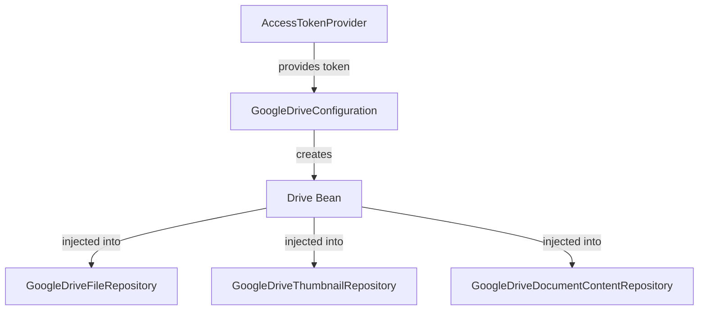

# Google Drive Bean Configuration Plan

## Overview

Extract the Google Drive service instantiation logic from individual repositories into a centralized Spring configuration class. This will enable better testability by allowing the Drive service to be mocked in tests and promote code reuse across all Google Drive-related repositories.

## Current State Analysis

### Problem
Currently, three repositories duplicate the Drive service instantiation logic:
- [`GoogleDriveFileRepository`](src/main/java/com/fde/google_drive_organizer/adapter/outbound/drive/GoogleDriveFileRepository.java:75-85)
- [`GoogleDriveThumbnailRepository`](src/main/java/com/fde/google_drive_organizer/adapter/outbound/drive/GoogleDriveThumbnailRepository.java:85-95)
- [`GoogleDriveDocumentContentRepository`](src/main/java/com/fde/google_drive_organizer/adapter/outbound/drive/GoogleDriveDocumentContentRepository.java:58-68)

Each repository contains a `buildDriveService()` method that:
1. Creates an `HttpRequestInitializer` with Bearer token authorization
2. Builds a Drive service with `GoogleNetHttpTransport`, `JacksonFactory`, and application name
3. Handles `GeneralSecurityException` and `IOException`

### Issues with Current Approach
1. **Code Duplication**: Same Drive instantiation logic repeated in 3 places
2. **Testing Difficulty**: Cannot easily mock Drive service calls in unit tests
3. **Inconsistency Risk**: Application name and JSON factory could diverge across implementations
4. **Tight Coupling**: Repositories are tightly coupled to Drive instantiation details

## Proposed Solution

### Architecture



### Design Decisions

#### 1. Configuration Class Location
**Decision**: Create [`GoogleDriveConfiguration`](src/main/java/com/fde/google_drive_organizer/adapter/outbound/drive/GoogleDriveConfiguration.java) in the `adapter.outbound.drive` package

**Rationale**:
- Follows existing pattern (see [`ThumbnailCacheConfiguration`](src/main/java/com/fde/google_drive_organizer/adapter/outbound/cache/ThumbnailCacheConfiguration.java))
- Co-locates configuration with the components it configures
- Maintains Clean Architecture boundaries (stays in adapter layer)

#### 2. Bean Scope
**Decision**: Use `@Scope(ConfigurableBeanFactory.SCOPE_PROTOTYPE)` for the Drive bean

**Rationale**:
- Drive service needs fresh access tokens for each request
- Access tokens can expire and need to be refreshed
- Prototype scope ensures a new Drive instance with current token on each injection
- Prevents stale token issues in long-running applications

#### 3. Constants Management
**Decision**: Extract shared constants to the configuration class

**Constants to centralize**:
- `APPLICATION_NAME = "Google Drive Organizer"`
- `JSON_FACTORY = JacksonFactory.getDefaultInstance()`

**Rationale**:
- Single source of truth for Drive service configuration
- Easier to maintain and update
- Prevents inconsistencies across repositories

#### 4. Error Handling Strategy
**Decision**: Wrap checked exceptions in `IllegalStateException` at bean creation time

**Rationale**:
- `GeneralSecurityException` during transport initialization indicates configuration error
- Should fail fast at application startup
- Repositories can focus on business logic errors

## Implementation Plan

### Step 1: Create GoogleDriveConfiguration Class

Create new configuration class with:
- `@Configuration` annotation
- `@Bean` method returning `Drive` instance
- `@Scope(SCOPE_PROTOTYPE)` for per-request instantiation
- Dependency on `AccessTokenProvider`
- Centralized constants for application name and JSON factory

```java
@Configuration
public class GoogleDriveConfiguration {
    
    public static final String APPLICATION_NAME = "Google Drive Organizer";
    private static final JsonFactory JSON_FACTORY = JacksonFactory.getDefaultInstance();
    
    @Bean
    @Scope(ConfigurableBeanFactory.SCOPE_PROTOTYPE)
    public Drive googleDrive(AccessTokenProvider accessTokenProvider) {
        // Implementation
    }
}
```

### Step 2: Update GoogleDriveFileRepository

**Changes**:
1. Remove `buildDriveService()` method (lines 75-85)
2. Remove `APPLICATION_NAME` and `JSON_FACTORY` constants (lines 21-22)
3. Add `Drive` as constructor parameter
4. Remove `AccessTokenProvider` dependency (no longer needed)
5. Update `getFilesInCheckInFolder()` to use injected Drive instance
6. Remove access token retrieval logic (handled by configuration)

**Impact**:
- Simplifies repository to focus on business logic
- Removes 15+ lines of infrastructure code
- Improves testability

### Step 3: Update GoogleDriveThumbnailRepository

**Changes**:
1. Remove `buildDriveService()` method (lines 85-95)
2. Add `Drive` as constructor parameter
3. Remove `AccessTokenProvider` dependency
4. Update `getThumbnail()` to use injected Drive instance
5. Keep `downloadThumbnailFromUrl()` method (still needs access token for direct HTTP call)

**Note**: This repository still needs `AccessTokenProvider` for the thumbnail download URL, but not for Drive service instantiation.

### Step 4: Update GoogleDriveDocumentContentRepository

**Changes**:
1. Remove `buildDriveService()` method (lines 58-68)
2. Add `Drive` as constructor parameter
3. Remove `AccessTokenProvider` dependency
4. Update `extractContent()` to use injected Drive instance

**Impact**:
- Cleanest refactoring (completely removes AccessTokenProvider dependency)
- Simplifies to single responsibility: content extraction

### Step 5: Update Tests

#### GoogleDriveFileRepositoryTest
**Changes**:
1. Add `@Mock Drive drive` field
2. Remove `AccessTokenProvider` mock setup
3. Mock Drive service methods directly
4. Update constructor calls to pass mocked Drive

**Benefits**:
- Can test Drive API interactions without real authentication
- Can simulate Drive API errors and edge cases
- Faster test execution (no HTTP transport initialization)

#### Create GoogleDriveThumbnailRepositoryTest
**Current State**: Test file exists but may need updates

**Changes**:
1. Mock Drive service
2. Test thumbnail retrieval logic
3. Test error scenarios

#### Create GoogleDriveDocumentContentRepositoryTest
**Current State**: No test file exists

**Changes**:
1. Create new test class
2. Mock Drive service and TikaDocumentParser
3. Test content extraction logic
4. Test error handling

### Step 6: Create Configuration Test

Create [`GoogleDriveConfigurationTest`](src/test/java/com/fde/google_drive_organizer/adapter/outbound/drive/GoogleDriveConfigurationTest.java) to verify:
1. Drive bean is created successfully with valid access token
2. Bean has prototype scope (new instance per request)
3. Drive service is configured with correct application name
4. Error handling for null/invalid access tokens

## Testing Strategy

### Unit Tests
- Mock Drive service in repository tests
- Verify Drive methods are called with correct parameters
- Test error handling without real Drive API calls

### Integration Tests
- Verify Drive bean is properly wired in Spring context
- Test with real AccessTokenProvider (if available)
- Validate prototype scope behavior

## Benefits

### Code Quality
- **DRY Principle**: Eliminates 30+ lines of duplicated code
- **Single Responsibility**: Repositories focus on business logic
- **Separation of Concerns**: Configuration separated from usage

### Testability
- **Mockability**: Drive service can be easily mocked in tests
- **Test Speed**: No need to initialize HTTP transport in tests
- **Test Coverage**: Can test error scenarios without real API calls

### Maintainability
- **Centralized Configuration**: Single place to update Drive setup
- **Consistency**: All repositories use same Drive configuration
- **Flexibility**: Easy to add Drive configuration options (timeouts, retry logic, etc.)

### Future Enhancements
- Add connection pooling configuration
- Add timeout configuration
- Add retry logic for transient failures
- Add metrics/monitoring for Drive API calls

## Migration Path

### Phase 1: Create Configuration (Non-Breaking)
1. Create `GoogleDriveConfiguration` class
2. Add tests for configuration
3. Deploy without using the bean yet

### Phase 2: Update Repositories (Breaking)
1. Update one repository at a time
2. Update corresponding tests
3. Verify functionality after each repository update

### Phase 3: Cleanup
1. Remove unused constants from repositories
2. Update documentation
3. Remove old buildDriveService methods

## Risks and Mitigations

### Risk: Token Expiration
**Mitigation**: Prototype scope ensures fresh token on each request

### Risk: Breaking Existing Tests
**Mitigation**: Update tests incrementally, one repository at a time

### Risk: Performance Impact
**Mitigation**: Drive instantiation is lightweight; prototype scope overhead is minimal

### Risk: Null Access Token
**Mitigation**: Configuration validates token at bean creation time

## Success Criteria

- [ ] All three repositories inject Drive bean instead of building it
- [ ] All repository tests mock Drive service successfully
- [ ] No code duplication for Drive instantiation
- [ ] All existing functionality works unchanged
- [ ] Test coverage maintained or improved
- [ ] Configuration class has comprehensive tests

## Related Files

### Source Files to Modify
- [`GoogleDriveFileRepository.java`](src/main/java/com/fde/google_drive_organizer/adapter/outbound/drive/GoogleDriveFileRepository.java)
- [`GoogleDriveThumbnailRepository.java`](src/main/java/com/fde/google_drive_organizer/adapter/outbound/drive/GoogleDriveThumbnailRepository.java)
- [`GoogleDriveDocumentContentRepository.java`](src/main/java/com/fde/google_drive_organizer/adapter/outbound/drive/GoogleDriveDocumentContentRepository.java)

### Source Files to Create
- `GoogleDriveConfiguration.java`

### Test Files to Modify
- [`GoogleDriveFileRepositoryTest.java`](src/test/java/com/fde/google_drive_organizer/adapter/outbound/drive/GoogleDriveFileRepositoryTest.java)
- [`GoogleDriveThumbnailRepositoryTest.java`](src/test/java/com/fde/google_drive_organizer/adapter/outbound/drive/GoogleDriveThumbnailRepositoryTest.java)

### Test Files to Create
- `GoogleDriveConfigurationTest.java`
- `GoogleDriveDocumentContentRepositoryTest.java` (if doesn't exist)

## References

- Similar pattern: [`ThumbnailCacheConfiguration`](src/main/java/com/fde/google_drive_organizer/adapter/outbound/cache/ThumbnailCacheConfiguration.java)
- Existing config: [`DriveConfig`](src/main/java/com/fde/google_drive_organizer/adapter/outbound/drive/DriveConfig.java)
- Spring Bean Scopes: https://docs.spring.io/spring-framework/reference/core/beans/factory-scopes.html
