# Inbound Port Interfaces for Use Cases

## Overview

This plan introduces inbound port interfaces for all use cases following the Hexagonal Architecture (Ports and Adapters) pattern. Currently, HTTP controllers (inbound adapters) directly depend on concrete use case implementations. This refactoring will introduce interfaces that decouple the adapters from the implementations.

## Current Architecture

```
adapter.inbound.http (Controllers)
    ↓ (direct dependency)
application.usecase (UC classes with @Service)
    ↓ (interface dependency)
application.port.outbound (Repository interfaces)
    ↑ (implemented by)
adapter.outbound (Repository implementations)
```

## Target Architecture

```
adapter.inbound.http (Controllers)
    ↓ (interface dependency)
application.port.inbound (Use Case interfaces)
    ↑ (implemented by)
application.usecase (UC classes with @Service)
    ↓ (interface dependency)
application.port.outbound (Repository interfaces)
    ↑ (implemented by)
adapter.outbound (Repository implementations)
```

## Benefits

1. **Dependency Inversion**: Controllers depend on abstractions, not concrete implementations
2. **Testability**: Easier to mock interfaces in controller tests
3. **Flexibility**: Can swap implementations without changing controllers
4. **Clean Architecture**: Clear separation between application core and adapters
5. **Consistency**: Mirrors the existing outbound port pattern

## Use Cases to Refactor

### 1. ExtractDocumentContentUC

**Current signature:**
```java
public DocumentContent execute(String fileId)
```

**New interface:** `ExtractDocumentContent`
- Location: `application/port/inbound/ExtractDocumentContent.java`
- Method: `DocumentContent extract(String fileId)`

**Used by:**
- [`ArchiveController`](src/main/java/com/fde/google_drive_organizer/adapter/inbound/http/ArchiveController.java:19)

### 2. GetThumbnailUC

**Current signature:**
```java
public byte[] execute(String fileId)
```

**New interface:** `GetThumbnail`
- Location: `application/port/inbound/GetThumbnail.java`
- Method: `byte[] get(String fileId)`

**Used by:**
- [`ThumbnailController`](src/main/java/com/fde/google_drive_organizer/adapter/inbound/http/ThumbnailController.java:18)

### 3. ListDriveFilesUC

**Current signature:**
```java
public List<DriveFile> execute()
```

**New interface:** `ListDriveFiles`
- Location: `application/port/inbound/ListDriveFiles.java`
- Method: `List<DriveFile> list()`

**Used by:**
- [`FileListController`](src/main/java/com/fde/google_drive_organizer/adapter/inbound/http/FileListController.java:22)

## Naming Conventions

### Interface Names
- Remove "UC" suffix from use case name
- Use verb-noun pattern (e.g., `GetThumbnail`, `ListDriveFiles`, `ExtractDocumentContent`)
- Keep names concise and action-oriented

### Method Names
- Use simple, descriptive verbs: `get()`, `list()`, `extract()`
- Avoid generic names like `execute()` - be specific to the action
- Match the domain language

### Rationale
- Interfaces represent capabilities/contracts, not implementations
- "UC" suffix is implementation detail
- Method names should clearly express intent
- Follows standard Java interface naming (e.g., `Comparable.compareTo()`, `Runnable.run()`)

## Implementation Steps

### Phase 1: Create Inbound Port Interfaces

Create three new interfaces in `application/port/inbound/`:

1. **ExtractDocumentContent.java**
```java
package com.fde.google_drive_organizer.application.port.inbound;

import com.fde.google_drive_organizer.domain.model.DocumentContent;

public interface ExtractDocumentContent {
    DocumentContent extract(String fileId);
}
```

2. **GetThumbnail.java**
```java
package com.fde.google_drive_organizer.application.port.inbound;

public interface GetThumbnail {
    byte[] get(String fileId);
}
```

3. **ListDriveFiles.java**
```java
package com.fde.google_drive_organizer.application.port.inbound;

import com.fde.google_drive_organizer.domain.model.DriveFile;
import java.util.List;

public interface ListDriveFiles {
    List<DriveFile> list();
}
```

### Phase 2: Update Use Case Implementations

Update each UC class to implement its corresponding interface:

1. **ExtractDocumentContentUC** implements `ExtractDocumentContent`
   - Keep existing `execute()` method
   - Add `extract()` method that delegates to `execute()`
   - Or rename `execute()` to `extract()` directly

2. **GetThumbnailUC** implements `GetThumbnail`
   - Keep existing `execute()` method
   - Add `get()` method that delegates to `execute()`
   - Or rename `execute()` to `get()` directly

3. **ListDriveFilesUC** implements `ListDriveFiles`
   - Keep existing `execute()` method
   - Add `list()` method that delegates to `execute()`
   - Or rename `execute()` to `list()` directly

**Recommendation**: Rename `execute()` methods to match interface method names for consistency.

### Phase 3: Update Controllers

Update each controller to depend on the interface instead of the concrete class:

1. **ArchiveController**
   - Change: `ExtractDocumentContentUC` → `ExtractDocumentContent`
   - Update method call: `extractDocumentContentUC.execute(fileId)` → `extractDocumentContent.extract(fileId)`

2. **ThumbnailController**
   - Change: `GetThumbnailUC` → `GetThumbnail`
   - Update method call: `getThumbnailUC.execute(fileId)` → `getThumbnail.get(fileId)`

3. **FileListController**
   - Change: `ListDriveFilesUC` → `ListDriveFiles`
   - Update method call: `listDriveFilesUseCase.execute()` → `listDriveFiles.list()`

### Phase 4: Update Controller Tests

Update test classes to mock the interfaces:

1. **ArchiveControllerTest**
   - Mock `ExtractDocumentContent` instead of `ExtractDocumentContentUC`
   - Update method calls to use `extract()`

2. **ThumbnailControllerTest**
   - Mock `GetThumbnail` instead of `GetThumbnailUC`
   - Update method calls to use `get()`

3. **FileListController test** (if exists)
   - Mock `ListDriveFiles` instead of `ListDriveFilesUC`
   - Update method calls to use `list()`

## Testing Strategy

### Unit Tests
- Use case tests remain unchanged (test concrete implementations)
- Controller tests now mock interfaces instead of concrete classes
- Verify all existing tests pass after refactoring

### Integration Tests
- Spring will autowire concrete implementations to interface dependencies
- No changes needed to integration tests

## Migration Strategy

This is a **non-breaking change** because:
1. Use case implementations remain as Spring `@Service` beans
2. Spring's dependency injection will automatically wire implementations to interface references
3. No changes to method signatures (only method names if renamed)
4. All existing functionality preserved

## Code Examples

### Before: ArchiveController
```java
private final ExtractDocumentContentUC extractDocumentContentUC;

public ArchiveController(ExtractDocumentContentUC extractDocumentContentUC) {
    this.extractDocumentContentUC = extractDocumentContentUC;
}

public ResponseEntity<Void> archiveFile(@PathVariable String fileId) {
    DocumentContent content = extractDocumentContentUC.execute(fileId);
    // ...
}
```

### After: ArchiveController
```java
private final ExtractDocumentContent extractDocumentContent;

public ArchiveController(ExtractDocumentContent extractDocumentContent) {
    this.extractDocumentContent = extractDocumentContent;
}

public ResponseEntity<Void> archiveFile(@PathVariable String fileId) {
    DocumentContent content = extractDocumentContent.extract(fileId);
    // ...
}
```

## Architecture Diagram

```mermaid
graph TB
    subgraph "Inbound Adapters"
        AC[ArchiveController]
        TC[ThumbnailController]
        FC[FileListController]
    end
    
    subgraph "Application Layer"
        subgraph "Inbound Ports"
            EDC[ExtractDocumentContent]
            GT[GetThumbnail]
            LDF[ListDriveFiles]
        end
        
        subgraph "Use Cases"
            EDUCUC[ExtractDocumentContentUC]
            GTUC[GetThumbnailUC]
            LDFUC[ListDriveFilesUC]
        end
        
        subgraph "Outbound Ports"
            DCR[DocumentContentRepository]
            TR[ThumbnailRepository]
            FR[FileRepository]
        end
    end
    
    subgraph "Outbound Adapters"
        GDDC[GoogleDriveDocumentContentRepository]
        GDTR[GoogleDriveThumbnailRepository]
        GDFR[GoogleDriveFileRepository]
    end
    
    AC -->|depends on| EDC
    TC -->|depends on| GT
    FC -->|depends on| LDF
    
    EDUCUC -->|implements| EDC
    GTUC -->|implements| GT
    LDFUC -->|implements| LDF
    
    EDUCUC -->|depends on| DCR
    GTUC -->|depends on| TR
    LDFUC -->|depends on| FR
    
    GDDC -->|implements| DCR
    GDTR -->|implements| TR
    GDFR -->|implements| FR
```



## Verification Checklist

- [ ] All three inbound port interfaces created
- [ ] All three use case classes implement their interfaces
- [ ] All three controllers updated to use interfaces
- [ ] All controller tests updated to mock interfaces
- [ ] All existing tests pass
- [ ] No compilation errors
- [ ] Application starts successfully
- [ ] Manual testing confirms functionality unchanged

## Future Considerations

### Additional Use Cases
When creating new use cases:
1. Create the inbound port interface first
2. Implement the interface in the UC class
3. Have controllers depend on the interface

### Alternative Implementations
The interface pattern allows for:
- Caching decorators
- Logging decorators
- Circuit breaker implementations
- Mock implementations for testing
- Different implementations for different contexts

### Consistency
Consider applying the same pattern to:
- Any future use cases
- Existing use cases not yet covered
- Other application services
