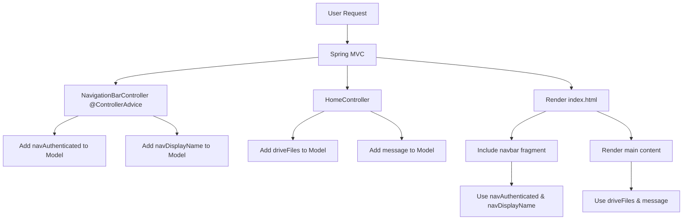

# Navigation Bar Component Refactoring Plan

## Overview
Refactor the navigation bar into a separate reusable component using Spring's `@ControllerAdvice` and Thymeleaf fragments. This will separate concerns and make the navigation bar available across all pages.

## Architecture Decision

### Using @ControllerAdvice with @ModelAttribute
Spring's `@ControllerAdvice` allows us to add model attributes globally to all controllers. This is perfect for navigation bar data that should be available on every page.

**Benefits:**
- Separation of concerns (navigation logic separate from page-specific logic)
- Reusable across all pages
- Centralized authentication display logic
- Follows Spring MVC best practices

## Component Structure

### 1. NavigationBarController (@ControllerAdvice)

**Location:** `src/main/java/com/fde/google_drive_organizer/adapter/inbound/http/NavigationBarController.java`

**Responsibilities:**
- Extract user authentication information
- Provide display name for authenticated users
- Add navigation-related model attributes globally

**Implementation:**
```java
@ControllerAdvice
public class NavigationBarController {
    
    @ModelAttribute("navAuthenticated")
    public boolean addAuthenticationStatus(@AuthenticationPrincipal OAuth2User user) {
        return user != null;
    }
    
    @ModelAttribute("navDisplayName")
    public String addDisplayName(@AuthenticationPrincipal OAuth2User user) {
        if (user == null) {
            return null;
        }
        
        Map<String, Object> attributes = user.getAttributes();
        String displayName = (String) attributes.getOrDefault("name", attributes.get("given_name"));
        if (displayName == null || displayName.isBlank()) {
            displayName = user.getName();
        }
        return displayName;
    }
}
```

### 2. Navigation Bar Template Fragment

**Location:** `src/main/resources/templates/fragments/navbar.html`

**Structure:**
```html
<!DOCTYPE html>
<html xmlns:th="http://www.thymeleaf.org">
<head>
    <meta charset="UTF-8">
</head>
<body>
    <nav th:fragment="navbar" class="container">
        <ul>
            <li><strong>Google Drive Organizer</strong></li>
        </ul>
        <ul>
            <li th:if="${navAuthenticated}">
                <span th:text="${navDisplayName}">User Name</span>
            </li>
            <li>
                <a th:if="${navAuthenticated}" href="/logout" role="button" class="secondary">Sign out</a>
                <a th:unless="${navAuthenticated}" href="/oauth2/authorization/google" role="button">Sign in with Google</a>
            </li>
        </ul>
    </nav>
</body>
</html>
```

### 3. Updated HomeController

**Changes:**
- Remove authentication-related model attributes (`authenticated`, `displayName`)
- Keep only page-specific logic (drive files, message)
- Simplified and focused on home page concerns

**Updated Implementation:**
```java
@Controller
public class HomeController {

    private static final String DRIVE_FILES = "driveFiles";
    private static final Logger log = LoggerFactory.getLogger(HomeController.class);

    private final ListDriveFilesUC listDriveFilesUseCase;

    public HomeController(ListDriveFilesUC listDriveFilesUseCase) {
        this.listDriveFilesUseCase = listDriveFilesUseCase;
    }

    @GetMapping("/")
    public String home(@AuthenticationPrincipal OAuth2User user, Model model) {
        if (user != null) {
            try {
                List<DriveFile> files = listDriveFilesUseCase.execute();
                model.addAttribute(DRIVE_FILES, files);
            } catch (IllegalStateException e) {
                String displayName = extractDisplayName(user);
                log.warn("Failed to retrieve drive files for user {}: {}", displayName, e.getMessage());
                model.addAttribute(DRIVE_FILES, Collections.emptyList());
            }
        } else {
            model.addAttribute(DRIVE_FILES, Collections.emptyList());
        }

        model.addAttribute("message", "Hello HTMX from Controller");
        return "index";
    }
    
    private String extractDisplayName(OAuth2User user) {
        Map<String, Object> attributes = user.getAttributes();
        String displayName = (String) attributes.getOrDefault("name", attributes.get("given_name"));
        if (displayName == null || displayName.isBlank()) {
            displayName = user.getName();
        }
        return displayName;
    }
}
```

### 4. Updated index.html

**Changes:**
- Include navigation bar fragment at the top
- Remove separate auth section from main
- Cleaner structure

**Updated Structure:**
```html
<!DOCTYPE html>
<html lang="en" xmlns:th="http://www.thymeleaf.org">
<head>
    <meta charset="UTF-8">
    <title>Google Drive Organizer</title>
    <link rel="stylesheet" href="https://cdn.jsdelivr.net/npm/@picocss/pico@2/css/pico.min.css">
    <script src="/webjars/htmx.org/2.0.8/dist/htmx.min.js"></script>
    <script>
        htmx.logAll();
    </script>
</head>
<body>
    <!-- Navigation Bar -->
    <div th:replace="~{fragments/navbar :: navbar}"></div>
    
    <!-- Header -->
    <header class="container">
        <hgroup>
            <h1>Google Drive Organizer</h1>
            <p th:text="${message}">Hello HTMX</p>
        </hgroup>
    </header>
    
    <!-- Main -->
    <main class="container">
        <!-- Google Drive Files Section -->
        <section id="preview" th:if="${navAuthenticated}">
            <h2>Google Drive Files</h2>
            <div th:if="${driveFiles != null and !driveFiles.isEmpty()}">
                <ul>
                    <li th:each="file : ${driveFiles}" th:text="${file.name()}"></li>
                </ul>
            </div>
            <div th:if="${driveFiles == null or driveFiles.isEmpty()}">
                <p>No files found in the configured folder.</p>
            </div>
        </section>
    </main>
</body>
</html>
```

## Implementation Flow Diagram



## Benefits of This Approach

### 1. Separation of Concerns
- **NavigationBarController**: Handles global navigation concerns
- **HomeController**: Handles page-specific concerns
- Clear boundaries between components

### 2. Reusability
- Navigation bar can be included in any template
- Authentication logic centralized in one place
- Easy to add new pages with consistent navigation

### 3. Maintainability
- Changes to navigation bar only require updating one component
- Easier to test (can test navigation logic separately)
- Follows Spring MVC patterns

### 4. Clean Architecture Alignment
- Adapter layer properly separated
- Each controller has a single responsibility
- Domain logic remains independent

## Files to Create/Modify

### New Files
1. [`src/main/java/com/fde/google_drive_organizer/adapter/inbound/http/NavigationBarController.java`](../src/main/java/com/fde/google_drive_organizer/adapter/inbound/http/NavigationBarController.java) - New @ControllerAdvice component
2. [`src/main/resources/templates/fragments/navbar.html`](../src/main/resources/templates/fragments/navbar.html) - Navigation bar fragment

### Modified Files
1. [`src/main/java/com/fde/google_drive_organizer/adapter/inbound/http/HomeController.java`](../src/main/java/com/fde/google_drive_organizer/adapter/inbound/http/HomeController.java) - Remove navigation logic
2. [`src/main/resources/templates/index.html`](../src/main/resources/templates/index.html) - Include navbar fragment

## Testing Considerations

### Unit Tests for NavigationBarController
```java
@ExtendWith(MockitoExtension.class)
class NavigationBarControllerTest {
    
    private NavigationBarController controller;
    
    @Mock
    private OAuth2User user;
    
    @BeforeEach
    void setUp() {
        controller = new NavigationBarController();
    }
    
    @Test
    void shouldReturnTrueWhenUserIsAuthenticated() {
        boolean result = controller.addAuthenticationStatus(user);
        assertThat(result).isTrue();
    }
    
    @Test
    void shouldReturnFalseWhenUserIsNotAuthenticated() {
        boolean result = controller.addAuthenticationStatus(null);
        assertThat(result).isFalse();
    }
    
    @Test
    void shouldExtractDisplayNameFromAttributes() {
        when(user.getAttributes()).thenReturn(Map.of("name", "John Doe"));
        
        String result = controller.addDisplayName(user);
        
        assertThat(result).isEqualTo("John Doe");
    }
}
```

## Migration Steps

1. Create `NavigationBarController` with `@ControllerAdvice`
2. Create `fragments/navbar.html` template
3. Update `HomeController` to remove navigation logic
4. Update `index.html` to include navbar fragment
5. Test authentication flow (sign in/sign out)
6. Verify responsive design on mobile devices

## Future Enhancements

- Add active page highlighting in navigation
- Support for multiple navigation items
- User profile dropdown menu
- Notification badges
- Dark mode toggle
