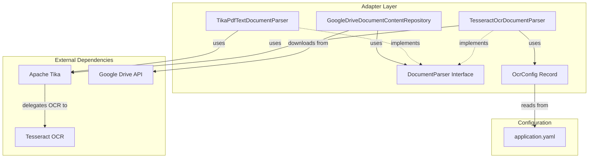
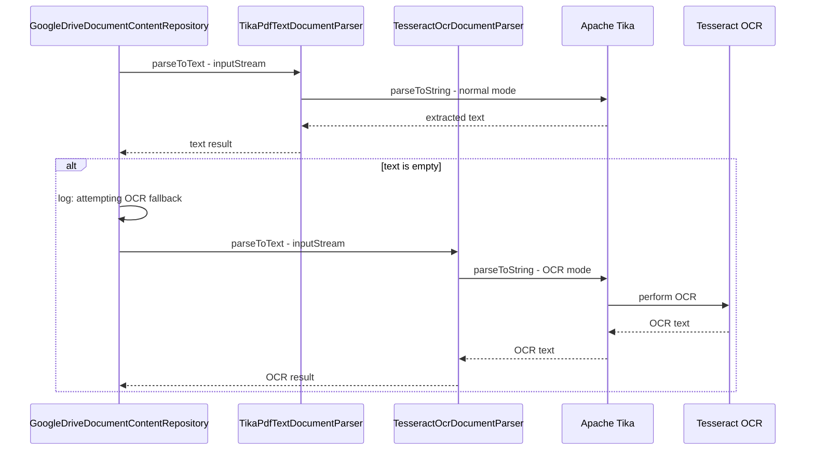

# OCR PDF Extraction Plan

## Overview

Enhance the existing PDF text extraction capability in [`GoogleDriveDocumentContentRepository`](../src/main/java/com/fde/google_drive_organizer/adapter/outbound/drive/GoogleDriveDocumentContentRepository.java) to support OCR (Optical Character Recognition) for image-based PDFs using Apache Tika with Tesseract.

## Current State

The current implementation uses Apache Tika for text extraction:

- [`TikaDocumentParser`](../src/main/java/com/fde/google_drive_organizer/adapter/outbound/tika/TikaDocumentParser.java) - Simple wrapper around Tika's `parseToString()`
- [`GoogleDriveDocumentContentRepository`](../src/main/java/com/fde/google_drive_organizer/adapter/outbound/drive/GoogleDriveDocumentContentRepository.java) - Downloads files from Google Drive and extracts text
- Works well for text-based PDFs but returns empty/minimal text for scanned/image-based PDFs

## Requirements

### Functional Requirements

1. **OCR Detection**: Automatically detect when a PDF needs OCR (empty text extraction)
2. **OCR Extraction**: Use Tesseract OCR via Tika to extract text from image-based PDFs
3. **Language Support**: Support German and English OCR (primary: German, secondary: English)
4. **Fallback Strategy**: Try normal extraction first, fall back to OCR only if text is empty
5. **Configuration**: Make OCR settings configurable via `application.yaml`

### Non-Functional Requirements

1. **Performance**: OCR is slower than text extraction; only use when necessary
2. **External Dependency**: Requires Tesseract to be installed on the system
3. **Maintainability**: Follow Clean Architecture boundaries
4. **Testability**: Unit tests should not require Tesseract installation

## Architecture

### Component Diagram



### Sequence Diagram - OCR Fallback Flow



## Implementation Details

### 1. Add Tesseract OCR Dependency

Update [`build.gradle.kts`](../build.gradle.kts):

```kotlin
dependencies {
    // ... existing dependencies
    implementation(libs.tika.core)
    implementation(libs.tika.parsers.standard)
    implementation(libs.tika.parser.pdf)  // NEW: explicit PDF parser
}
```

Update [`gradle/libs.versions.toml`](../gradle/libs.versions.toml):

```toml
[libraries]
# ... existing libraries
tika-parser-pdf = { group = "org.apache.tika", name = "tika-parser-pdf-module", version.ref = "tika" }
```

**Note**: Tesseract itself is an external system dependency and must be installed separately.

### 2. Create OcrConfig Record

Create new file: `src/main/java/com/fde/google_drive_organizer/adapter/outbound/tika/OcrConfig.java`

```java
package com.fde.google_drive_organizer.adapter.outbound.tika;

import org.springframework.boot.context.properties.ConfigurationProperties;

@ConfigurationProperties(prefix = "ocr")
public record OcrConfig(
    String language,
    String tesseractPath
) {
    public OcrConfig {
        // Default values
        if (language == null || language.isBlank()) {
            language = "deu+eng";
        }
        // tesseractPath can be null - Tika will use system PATH
    }
}
```

### 3. Update application.yaml

Add OCR configuration to [`src/main/resources/application.yaml`](../src/main/resources/application.yaml):

```yaml
ocr:
  language: deu+eng  # German + English
  tesseract-path: ${TESSERACT_PATH:}  # Optional: path to tesseract executable
```

### 4. Create DocumentParser Interface

Create new file: `src/main/java/com/fde/google_drive_organizer/adapter/outbound/tika/DocumentParser.java`

```java
package com.fde.google_drive_organizer.adapter.outbound.tika;

import org.apache.tika.exception.TikaException;

import java.io.IOException;
import java.io.InputStream;

/**
 * Interface for document text extraction strategies.
 */
public interface DocumentParser {
    
    /**
     * Extracts text content from the given input stream.
     *
     * @param inputStream the document content stream
     * @return extracted text, or empty string if no text could be extracted
     * @throws IOException if reading the stream fails
     * @throws TikaException if parsing fails
     */
    String parseToText(InputStream inputStream) throws IOException, TikaException;
}
```

### 5. Rename TikaDocumentParser to TikaPdfTextDocumentParser

Rename and update [`TikaDocumentParser`](../src/main/java/com/fde/google_drive_organizer/adapter/outbound/tika/TikaDocumentParser.java) to `TikaPdfTextDocumentParser`:

```java
package com.fde.google_drive_organizer.adapter.outbound.tika;

import org.apache.tika.Tika;
import org.apache.tika.exception.TikaException;
import org.apache.tika.exception.ZeroByteFileException;
import org.springframework.stereotype.Component;

import java.io.IOException;
import java.io.InputStream;

@Component
public class TikaPdfTextDocumentParser implements DocumentParser {

    private final Tika tika = new Tika();

    @Override
    public String parseToText(InputStream inputStream) throws IOException, TikaException {
        try {
            return tika.parseToString(inputStream);
        } catch (ZeroByteFileException e) {
            return "";
        }
    }
}
```

### 6. Create TesseractOcrDocumentParser

Create new file: `src/main/java/com/fde/google_drive_organizer/adapter/outbound/tika/TesseractOcrDocumentParser.java`

```java
package com.fde.google_drive_organizer.adapter.outbound.tika;

import org.apache.tika.exception.TikaException;
import org.apache.tika.exception.ZeroByteFileException;
import org.apache.tika.metadata.Metadata;
import org.apache.tika.parser.AutoDetectParser;
import org.apache.tika.parser.ParseContext;
import org.apache.tika.parser.pdf.PDFParserConfig;
import org.apache.tika.parser.ocr.TesseractOCRConfig;
import org.apache.tika.sax.BodyContentHandler;
import org.slf4j.Logger;
import org.slf4j.LoggerFactory;
import org.springframework.boot.context.properties.EnableConfigurationProperties;
import org.springframework.stereotype.Component;

import java.io.IOException;
import java.io.InputStream;

@Component
@EnableConfigurationProperties(OcrConfig.class)
public class TesseractOcrDocumentParser implements DocumentParser {

    private static final Logger log = LoggerFactory.getLogger(TesseractOcrDocumentParser.class);

    private final OcrConfig ocrConfig;

    public TesseractOcrDocumentParser(OcrConfig ocrConfig) {
        this.ocrConfig = ocrConfig;
    }

    @Override
    public String parseToText(InputStream inputStream) throws IOException, TikaException {
        try {
            // Configure Tesseract OCR
            TesseractOCRConfig tesseractConfig = new TesseractOCRConfig();
            tesseractConfig.setLanguage(ocrConfig.language());

            if (ocrConfig.tesseractPath() != null && !ocrConfig.tesseractPath().isBlank()) {
                tesseractConfig.setTesseractPath(ocrConfig.tesseractPath());
            }

            // Configure PDF parser to use OCR
            PDFParserConfig pdfConfig = new PDFParserConfig();
            pdfConfig.setExtractInlineImages(true);
            pdfConfig.setOcrStrategy(PDFParserConfig.OCR_STRATEGY.OCR_ONLY);

            // Set up parse context
            ParseContext parseContext = new ParseContext();
            parseContext.set(TesseractOCRConfig.class, tesseractConfig);
            parseContext.set(PDFParserConfig.class, pdfConfig);

            // Parse with OCR
            AutoDetectParser parser = new AutoDetectParser();
            BodyContentHandler handler = new BodyContentHandler(-1); // no limit
            Metadata metadata = new Metadata();

            parser.parse(inputStream, handler, metadata, parseContext);

            String ocrText = handler.toString();
            log.debug("OCR extraction completed, extracted {} characters", ocrText.length());
            return ocrText;

        } catch (ZeroByteFileException e) {
            return "";
        }
    }
}
```

### 7. Update GoogleDriveDocumentContentRepository

Update [`GoogleDriveDocumentContentRepository`](../src/main/java/com/fde/google_drive_organizer/adapter/outbound/drive/GoogleDriveDocumentContentRepository.java) to use both parsers with fallback logic:

```java
package com.fde.google_drive_organizer.adapter.outbound.drive;

import com.fde.google_drive_organizer.adapter.outbound.tika.TikaPdfTextDocumentParser;
import com.fde.google_drive_organizer.adapter.outbound.tika.TesseractOcrDocumentParser;
import com.fde.google_drive_organizer.application.port.outbound.DocumentContentRepository;
import com.fde.google_drive_organizer.domain.exception.DocumentContentExtractionException;
import com.fde.google_drive_organizer.domain.model.DocumentContent;
import com.google.api.services.drive.Drive;
import org.apache.tika.exception.TikaException;
import org.slf4j.Logger;
import org.slf4j.LoggerFactory;
import org.springframework.stereotype.Repository;

import java.io.ByteArrayInputStream;
import java.io.IOException;
import java.io.InputStream;

@Repository
public class GoogleDriveDocumentContentRepository implements DocumentContentRepository {

    private static final Logger log = LoggerFactory.getLogger(GoogleDriveDocumentContentRepository.class);

    private final Drive drive;
    private final TikaPdfTextDocumentParser textParser;
    private final TesseractOcrDocumentParser ocrParser;

    public GoogleDriveDocumentContentRepository(
            Drive drive,
            TikaPdfTextDocumentParser textParser,
            TesseractOcrDocumentParser ocrParser
    ) {
        this.drive = drive;
        this.textParser = textParser;
        this.ocrParser = ocrParser;
    }

    @Override
    public DocumentContent extractContent(String fileId) {
        try (InputStream inputStream = drive.files().get(fileId).executeMediaAsInputStream()) {
            // Read stream into byte array so we can reuse it for OCR fallback
            byte[] content = inputStream.readAllBytes();

            // First attempt: normal text extraction
            String extractedText = textParser.parseToText(new ByteArrayInputStream(content));

            // If extraction returned empty text, try OCR
            if (extractedText.isEmpty()) {
                log.info("Normal text extraction returned empty result for file {}, attempting OCR", fileId);
                extractedText = ocrParser.parseToText(new ByteArrayInputStream(content));
            }

            return new DocumentContent(extractedText);

        } catch (IOException | TikaException e) {
            throw new DocumentContentExtractionException("Failed to extract content from file: " + fileId, e);
        }
    }
}
```

### 8. Testing Strategy

#### Unit Tests for TikaPdfTextDocumentParser

Rename [`TikaDocumentParserTest`](../src/test/java/com/fde/google_drive_organizer/adapter/outbound/tika/TikaDocumentParserTest.java) to `TikaPdfTextDocumentParserTest`:

```java
package com.fde.google_drive_organizer.adapter.outbound.tika;

import org.apache.tika.exception.TikaException;
import org.junit.jupiter.api.Test;

import java.io.ByteArrayInputStream;
import java.io.IOException;
import java.io.InputStream;
import java.nio.charset.StandardCharsets;

import static org.assertj.core.api.Assertions.assertThat;

class TikaPdfTextDocumentParserTest {

    private final TikaPdfTextDocumentParser parser = new TikaPdfTextDocumentParser();

    @Test
    void shouldParseTextFromPlainTextInputStream() throws IOException, TikaException {
        String content = "Hello, this is plain text content.";
        InputStream inputStream = new ByteArrayInputStream(content.getBytes(StandardCharsets.UTF_8));

        String result = parser.parseToText(inputStream);

        assertThat(result).contains("Hello, this is plain text content.");
    }

    @Test
    void shouldReturnEmptyStringForEmptyInputStream() throws IOException, TikaException {
        InputStream inputStream = new ByteArrayInputStream(new byte[0]);

        String result = parser.parseToText(inputStream);

        assertThat(result).isEmpty();
    }
}
```

#### Unit Tests for TesseractOcrDocumentParser

Create test: `src/test/java/com/fde/google_drive_organizer/adapter/outbound/tika/TesseractOcrDocumentParserTest.java`

```java
package com.fde.google_drive_organizer.adapter.outbound.tika;

import org.junit.jupiter.api.Test;

import static org.assertj.core.api.Assertions.assertThat;

class TesseractOcrDocumentParserTest {

    @Test
    void shouldCreateParserWithDefaultConfig() {
        OcrConfig config = new OcrConfig("deu+eng", null);
        TesseractOcrDocumentParser parser = new TesseractOcrDocumentParser(config);

        assertThat(parser).isNotNull();
    }

    @Test
    void shouldCreateParserWithCustomTesseractPath() {
        OcrConfig config = new OcrConfig("eng", "/usr/local/bin/tesseract");
        TesseractOcrDocumentParser parser = new TesseractOcrDocumentParser(config);

        assertThat(parser).isNotNull();
    }
}
```

**Note**: Testing actual OCR requires:
- Tesseract installed on test machine
- Sample OCR PDF files
- Integration tests (not unit tests)

#### Integration Test for OCR

Create integration test: `src/test/java/com/fde/google_drive_organizer/adapter/outbound/tika/TesseractOcrDocumentParserIntegrationTest.java`

```java
package com.fde.google_drive_organizer.adapter.outbound.tika;

import org.apache.tika.exception.TikaException;
import org.junit.jupiter.api.Test;
import org.junit.jupiter.api.condition.EnabledIfEnvironmentVariable;

import java.io.IOException;
import java.io.InputStream;

import static org.assertj.core.api.Assertions.assertThat;

@EnabledIfEnvironmentVariable(named = "TESSERACT_INSTALLED", matches = "true")
class TesseractOcrDocumentParserIntegrationTest {

    private final OcrConfig ocrConfig = new OcrConfig("deu+eng", null);
    private final TesseractOcrDocumentParser parser = new TesseractOcrDocumentParser(ocrConfig);

    @Test
    void shouldExtractTextFromOcrPdf() throws IOException, TikaException {
        // Load test OCR PDF from resources
        try (InputStream inputStream = getClass().getResourceAsStream("/test-ocr-document.pdf")) {
            String result = parser.parseToText(inputStream);

            assertThat(result).isNotEmpty();
            assertThat(result.length()).isGreaterThan(10);
        }
    }
}
```

#### Unit Tests for GoogleDriveDocumentContentRepository

Create/update test: `src/test/java/com/fde/google_drive_organizer/adapter/outbound/drive/GoogleDriveDocumentContentRepositoryTest.java`

```java
package com.fde.google_drive_organizer.adapter.outbound.drive;

import com.fde.google_drive_organizer.adapter.outbound.tika.TikaPdfTextDocumentParser;
import com.fde.google_drive_organizer.adapter.outbound.tika.TesseractOcrDocumentParser;
import com.fde.google_drive_organizer.domain.exception.DocumentContentExtractionException;
import com.fde.google_drive_organizer.domain.model.DocumentContent;
import com.google.api.services.drive.Drive;
import com.google.api.services.drive.Drive.Files;
import com.google.api.services.drive.Drive.Files.Get;
import org.apache.tika.exception.TikaException;
import org.junit.jupiter.api.BeforeEach;
import org.junit.jupiter.api.Test;
import org.junit.jupiter.api.extension.ExtendWith;
import org.mockito.Mock;
import org.mockito.junit.jupiter.MockitoExtension;

import java.io.ByteArrayInputStream;
import java.io.IOException;
import java.io.InputStream;
import java.nio.charset.StandardCharsets;

import static org.assertj.core.api.Assertions.assertThat;
import static org.assertj.core.api.Assertions.assertThatThrownBy;
import static org.mockito.Mockito.when;

@ExtendWith(MockitoExtension.class)
class GoogleDriveDocumentContentRepositoryTest {

    @Mock
    private Drive drive;

    @Mock
    private Files files;

    @Mock
    private Get get;

    @Mock
    private TikaPdfTextDocumentParser textParser;

    @Mock
    private TesseractOcrDocumentParser ocrParser;

    private GoogleDriveDocumentContentRepository repository;

    @BeforeEach
    void setUp() {
        repository = new GoogleDriveDocumentContentRepository(drive, textParser, ocrParser);
    }

    @Test
    void shouldExtractContentUsingTextParser() throws IOException, TikaException {
        String fileId = "test-file-id";
        byte[] content = "PDF content".getBytes(StandardCharsets.UTF_8);
        InputStream inputStream = new ByteArrayInputStream(content);

        when(drive.files()).thenReturn(files);
        when(files.get(fileId)).thenReturn(get);
        when(get.executeMediaAsInputStream()).thenReturn(inputStream);
        when(textParser.parseToText(org.mockito.ArgumentMatchers.any())).thenReturn("Extracted text");

        DocumentContent result = repository.extractContent(fileId);

        assertThat(result.text()).isEqualTo("Extracted text");
    }

    @Test
    void shouldFallbackToOcrWhenTextParserReturnsEmpty() throws IOException, TikaException {
        String fileId = "test-file-id";
        byte[] content = "PDF content".getBytes(StandardCharsets.UTF_8);
        InputStream inputStream = new ByteArrayInputStream(content);

        when(drive.files()).thenReturn(files);
        when(files.get(fileId)).thenReturn(get);
        when(get.executeMediaAsInputStream()).thenReturn(inputStream);
        when(textParser.parseToText(org.mockito.ArgumentMatchers.any())).thenReturn("");
        when(ocrParser.parseToText(org.mockito.ArgumentMatchers.any())).thenReturn("OCR extracted text");

        DocumentContent result = repository.extractContent(fileId);

        assertThat(result.text()).isEqualTo("OCR extracted text");
    }

    @Test
    void shouldThrowExceptionWhenDriveAccessFails() throws IOException {
        String fileId = "test-file-id";

        when(drive.files()).thenReturn(files);
        when(files.get(fileId)).thenReturn(get);
        when(get.executeMediaAsInputStream()).thenThrow(new IOException("Drive error"));

        assertThatThrownBy(() -> repository.extractContent(fileId))
                .isInstanceOf(DocumentContentExtractionException.class)
                .hasMessageContaining("Failed to extract content from file: test-file-id");
    }
}
```

### 9. Configuration Tests

Create test: `src/test/java/com/fde/google_drive_organizer/adapter/outbound/tika/OcrConfigTest.java`

```java
package com.fde.google_drive_organizer.adapter.outbound.tika;

import org.junit.jupiter.api.Test;

import static org.assertj.core.api.Assertions.assertThat;

class OcrConfigTest {

    @Test
    void shouldUseDefaultLanguageWhenNull() {
        OcrConfig config = new OcrConfig(null, null);
        
        assertThat(config.language()).isEqualTo("deu+eng");
    }

    @Test
    void shouldUseDefaultLanguageWhenBlank() {
        OcrConfig config = new OcrConfig("  ", null);
        
        assertThat(config.language()).isEqualTo("deu+eng");
    }

    @Test
    void shouldUseProvidedLanguage() {
        OcrConfig config = new OcrConfig("eng", null);
        
        assertThat(config.language()).isEqualTo("eng");
    }

    @Test
    void shouldAllowNullTesseractPath() {
        OcrConfig config = new OcrConfig("deu+eng", null);
        
        assertThat(config.tesseractPath()).isNull();
    }

    @Test
    void shouldUseProvidedTesseractPath() {
        OcrConfig config = new OcrConfig("deu+eng", "/usr/bin/tesseract");
        
        assertThat(config.tesseractPath()).isEqualTo("/usr/bin/tesseract");
    }
}
```

## Installation Requirements

### Tesseract Installation

#### Windows
```powershell
# Using Chocolatey
choco install tesseract

# Or download installer from:
# https://github.com/UB-Mannheim/tesseract/wiki
```

#### macOS
```bash
brew install tesseract
brew install tesseract-lang  # for additional languages
```

#### Linux (Ubuntu/Debian)
```bash
sudo apt-get update
sudo apt-get install tesseract-ocr
sudo apt-get install tesseract-ocr-deu  # German language pack
sudo apt-get install tesseract-ocr-eng  # English language pack
```

### Verify Installation
```bash
tesseract --version
tesseract --list-langs
```

## Configuration Examples

### Default Configuration (Tesseract on PATH)
```yaml
ocr:
  language: deu+eng
```

### Custom Tesseract Path
```yaml
ocr:
  language: deu+eng
  tesseract-path: C:/Program Files/Tesseract-OCR/tesseract.exe
```

### English Only
```yaml
ocr:
  language: eng
```

## Deployment Considerations

1. **Docker**: If deploying in Docker, include Tesseract in the image:
   ```dockerfile
   FROM eclipse-temurin:25-jre
   RUN apt-get update && \
       apt-get install -y tesseract-ocr tesseract-ocr-deu tesseract-ocr-eng && \
       rm -rf /var/lib/apt/lists/*
   ```

2. **Environment Variables**: Set `TESSERACT_PATH` if Tesseract is not on PATH

3. **Performance**: OCR is CPU-intensive; consider:
   - Caching OCR results
   - Async processing for large documents
   - Resource limits in production

## Risks and Mitigations

| Risk | Impact | Mitigation |
|------|--------|------------|
| Tesseract not installed | OCR fails | Clear error messages, documentation |
| OCR is slow | Poor UX | Only use OCR when needed (empty text check) |
| Wrong language configured | Poor OCR accuracy | Configurable via application.yaml |
| Large PDF files | Memory issues | Stream processing, consider file size limits |
| OCR quality varies | Inaccurate text | Log OCR attempts, allow manual review |

## Success Criteria

- [ ] Normal text extraction still works for text-based PDFs
- [ ] OCR extraction works for image-based PDFs
- [ ] Empty PDFs return empty string without errors
- [ ] Configuration is loaded from application.yaml
- [ ] Unit tests pass without Tesseract installed
- [ ] Integration tests pass with Tesseract installed
- [ ] Documentation is clear about Tesseract requirements
- [ ] Performance is acceptable (OCR only when needed)

## Future Enhancements

1. **Caching**: Cache OCR results to avoid re-processing
2. **Async Processing**: Process OCR in background for large files
3. **Quality Metrics**: Track OCR confidence scores
4. **Hybrid Strategy**: Try OCR_AND_TEXT_EXTRACTION strategy
5. **Language Detection**: Auto-detect document language
6. **Progress Tracking**: Show OCR progress for large documents
