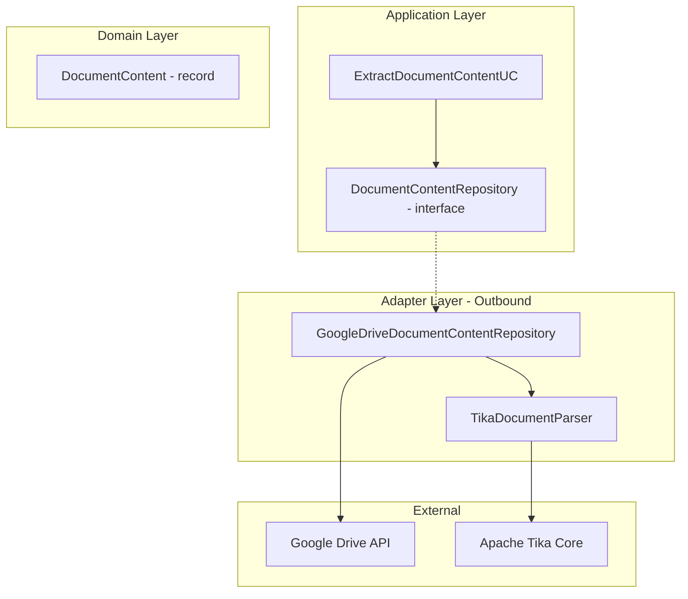
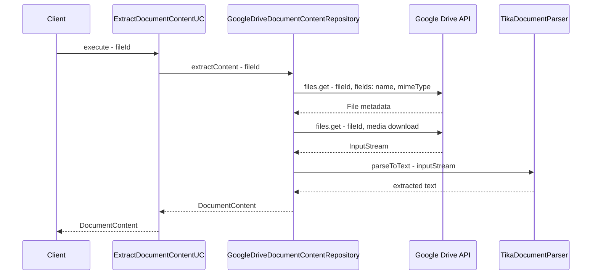

# PDF Text Extraction Plan

## Overview

Implement PDF text extraction capability using Apache Tika to extract content from PDF files stored in Google Drive. The extracted text will be used for AI analysis in future features.

## Requirements

- **Source**: PDF files from Google Drive only
- **Output**: File name + full text content
- **Library**: Apache Tika (wraps PDFBox, extensible to other document types)
- **Future use**: AI analysis integration

## Architecture

Following the existing Clean Architecture patterns in the project:



## Domain Model

### DocumentContent Record

```java
// Location: domain/model/DocumentContent.java
public record DocumentContent(
    String fileName,
    String textContent
) {
    public DocumentContent {
        if (fileName == null || fileName.isBlank()) {
            throw new IllegalArgumentException("File name cannot be null or empty");
        }
        if (textContent == null) {
            throw new IllegalArgumentException("Text content cannot be null");
        }
    }
}
```

## Port Interface

### DocumentContentRepository

```java
// Location: application/port/outbound/DocumentContentRepository.java
public interface DocumentContentRepository {
    
    DocumentContent extractContent(String fileId);
}
```

## Adapter Implementation

### GoogleDriveDocumentContentRepository

```java
// Location: adapter/outbound/drive/GoogleDriveDocumentContentRepository.java
@Repository
public class GoogleDriveDocumentContentRepository implements DocumentContentRepository {
    
    private final AccessTokenProvider accessTokenProvider;
    private final TikaDocumentParser tikaDocumentParser;
    
    @Override
    public DocumentContent extractContent(String fileId) {
        // 1. Get file metadata from Drive API to retrieve file name
        // 2. Download file content as InputStream
        // 3. Parse content using TikaDocumentParser
        // 4. Return DocumentContent with fileName and textContent
    }
}
```

### TikaDocumentParser

```java
// Location: adapter/outbound/tika/TikaDocumentParser.java
@Component
public class TikaDocumentParser {
    
    private final Tika tika = new Tika();
    
    public String parseToText(InputStream inputStream) {
        return tika.parseToString(inputStream);
    }
}
```

## Use Case

### ExtractDocumentContentUC

```java
// Location: application/usecase/ExtractDocumentContentUC.java
@Service
public class ExtractDocumentContentUC {
    
    private final DocumentContentRepository documentContentRepository;
    
    public ExtractDocumentContentUC(DocumentContentRepository documentContentRepository) {
        this.documentContentRepository = documentContentRepository;
    }
    
    public DocumentContent execute(String fileId) {
        return documentContentRepository.extractContent(fileId);
    }
}
```

## Dependency Configuration

### libs.versions.toml additions

```toml
[versions]
# ... existing versions
tika = "3.1.0"

[libraries]
# ... existing libraries
tika-core = { group = "org.apache.tika", name = "tika-core", version.ref = "tika" }
tika-parsers-standard = { group = "org.apache.tika", name = "tika-parsers-standard-package", version.ref = "tika" }
```

### build.gradle.kts additions

```kotlin
dependencies {
    // ... existing dependencies
    implementation(libs.tika.core)
    implementation(libs.tika.parsers.standard)
}
```

## Sequence Diagram



## Implementation Tasks

- [ ] Add Apache Tika dependencies to `libs.versions.toml`
- [ ] Add Tika dependencies to `build.gradle.kts`
- [ ] Create `DocumentContent` record in domain/model
- [ ] Create `DocumentContentRepository` interface in application/port/outbound
- [ ] Create `TikaDocumentParser` class
- [ ] Create `GoogleDriveDocumentContentRepository` implementation
- [ ] Create `ExtractDocumentContentUC` use case
- [ ] Write unit tests for `DocumentContent` record
- [ ] Write unit tests for `TikaDocumentParser`
- [ ] Write unit tests for `GoogleDriveDocumentContentRepository`
- [ ] Write unit tests for `ExtractDocumentContentUC`

## File Structure

```
src/main/java/com/fde/google_drive_organizer/
├── domain/
│   └── model/
│       └── DocumentContent.java               # NEW
├── application/
│   ├── port/
│   │   └── outbound/
│   │       └── DocumentContentRepository.java # NEW
│   └── usecase/
│       └── ExtractDocumentContentUC.java      # NEW
└── adapter/
    └── outbound/
        ├── drive/
        │   └── GoogleDriveDocumentContentRepository.java  # NEW
        └── tika/
            └── TikaDocumentParser.java        # NEW

src/test/java/com/fde/google_drive_organizer/
├── domain/
│   └── model/
│       ├── DocumentContentTest.java           # NEW
│       └── DocumentContentTestFixture.java    # NEW
├── application/
│   └── usecase/
│       └── ExtractDocumentContentUCTest.java  # NEW
└── adapter/
    └── outbound/
        ├── drive/
        │   └── GoogleDriveDocumentContentRepositoryTest.java  # NEW
        └── tika/
            └── TikaDocumentParserTest.java    # NEW
```

## Notes

- Apache Tika automatically detects document type and uses appropriate parser
- Tika supports PDF, Word, Excel, PowerPoint, and many other formats out of the box
- No interface for TikaDocumentParser yet - can be added later if needed (YAGNI)
- Consider adding content size limits for large documents
- Consider adding caching for extracted content if needed for performance
