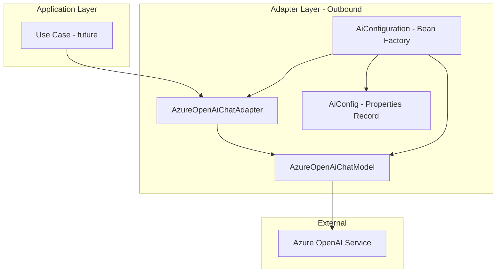

# Spring AI with Azure OpenAI Setup Plan

## Overview

This plan outlines the setup of Spring AI **core libraries** (without auto-configuration starters) with Azure OpenAI configuration for the Google Drive Organizer project. The goal is to establish the foundation for AI-powered file scanning, renaming, and organization features while maintaining full control over bean configuration.

## Architecture



## Configuration Properties

The configuration will follow the existing project pattern using immutable records:

```yaml
# application.yaml
ai:
  endpoint: ${AZURE_OPENAI_ENDPOINT}
  api-key: ${AZURE_OPENAI_API_KEY}
  deployment-name: ${AZURE_OPENAI_DEPLOYMENT_NAME}
```

| Property | Description | Required | Default |
|----------|-------------|----------|---------|
| `ai.endpoint` | Azure OpenAI endpoint URL | Yes | - |
| `ai.api-key` | Azure OpenAI API key | Yes | - |
| `ai.deployment-name` | Azure OpenAI deployment/model name | Yes | - |

## Implementation Tasks

### 1. Add Spring AI Core Dependencies

Update [`gradle/libs.versions.toml`](gradle/libs.versions.toml) to add Spring AI BOM and **core** Azure OpenAI library (not the starter):

```toml
[versions]
spring-ai = "1.0.0"

[libraries]
spring-ai-bom = { group = "org.springframework.ai", name = "spring-ai-bom", version.ref = "spring-ai" }
spring-ai-azure-openai = { group = "org.springframework.ai", name = "spring-ai-azure-openai" }
```

Update [`build.gradle.kts`](build.gradle.kts):

```kotlin
dependencies {
    implementation(platform(libs.spring.ai.bom))
    implementation(libs.spring.ai.azure.openai)
}
```

**Note:** Using `spring-ai-azure-openai` (core) instead of `spring-ai-azure-openai-spring-boot-starter` gives us:
- No auto-configuration - we control all bean creation
- Smaller dependency footprint
- Explicit configuration in our `@Configuration` class

### 2. Create Configuration Properties Record

Create `AiConfig.java` in `adapter/outbound/ai/`:

```java
@ConfigurationProperties(prefix = "ai")
public record AiConfig(
    String endpoint,
    String apiKey,
    String deploymentName
) {}
```

### 3. Create AI Configuration Class

Create `AiConfiguration.java` in `adapter/outbound/ai/`:

Since we're using the core library (not the starter), we need to manually configure the beans:

```java
@Configuration
@EnableConfigurationProperties(AiConfig.class)
public class AiConfiguration {

    @Bean
    public OpenAIClient openAIClient(AiConfig config) {
        return new OpenAIClientBuilder()
            .endpoint(config.endpoint())
            .credential(new AzureKeyCredential(config.apiKey()))
            .buildClient();
    }

    @Bean
    public AzureOpenAiChatModel azureOpenAiChatModel(OpenAIClient openAIClient, AiConfig config) {
        return AzureOpenAiChatModel.builder()
            .openAIClient(openAIClient)
            .defaultOptions(AzureOpenAiChatOptions.builder()
                .deploymentName(config.deploymentName())
                .build())
            .build();
    }

    @Bean
    public ChatClient chatClient(AzureOpenAiChatModel chatModel) {
        return ChatClient.builder(chatModel).build();
    }
}
```

### 4. Create Domain Port Interface

Create `AiChatPort.java` in `domain/port/outbound/`:

```java
public interface AiChatPort {
    String chat(String prompt);
}
```

### 5. Create Adapter Implementation

Create `AzureOpenAiChatAdapter.java` in `adapter/outbound/ai/`:

```java
@Component
public class AzureOpenAiChatAdapter implements AiChatPort {

    private final ChatClient chatClient;

    public AzureOpenAiChatAdapter(ChatClient chatClient) {
        this.chatClient = chatClient;
    }

    @Override
    public String chat(String prompt) {
        return chatClient.prompt()
            .user(prompt)
            .call()
            .content();
    }
}
```

### 6. Add Configuration to application.yaml

Add placeholder configuration with environment variable references.

### 7. Write Tests

- `AiConfigTest.java` - Test property binding
- `AiConfigDefaultTest.java` - Test default values (if any)
- `AzureOpenAiChatAdapterTest.java` - Unit test with mocked ChatClient

## File Structure

```
src/main/java/com/fde/google_drive_organizer/
├── adapter/outbound/ai/
│   ├── AiConfig.java                    # Configuration properties record
│   ├── AiConfiguration.java             # Spring configuration class
│   └── AzureOpenAiChatAdapter.java      # ChatClient adapter implementation
└── domain/port/outbound/
    └── AiChatPort.java                  # Port interface for AI chat

src/test/java/com/fde/google_drive_organizer/
└── adapter/outbound/ai/
    ├── AiConfigTest.java                # Property binding test
    ├── AiConfigDefaultTest.java         # Default values test
    └── AzureOpenAiChatAdapterTest.java  # Adapter unit test
```

## Environment Variables

The following environment variables need to be set:

| Variable | Description |
|----------|-------------|
| `AZURE_OPENAI_ENDPOINT` | Azure OpenAI service endpoint URL |
| `AZURE_OPENAI_API_KEY` | Azure OpenAI API key |
| `AZURE_OPENAI_DEPLOYMENT_NAME` | Deployment name for the model |

## Notes

- Spring AI provides auto-configuration for Azure OpenAI when the starter is on the classpath
- The `ChatClient` is the primary interface for interacting with the AI model
- Following Clean Architecture, the domain layer will not depend on Spring AI directly - only through the port interface
- Tests will use mocking to avoid actual API calls

## Future Considerations

Once this foundation is in place, the next steps would be:
1. Create use cases for file content analysis
2. Implement file renaming logic based on AI suggestions
3. Implement folder categorization logic
4. Add folder tree configuration for organizing files
