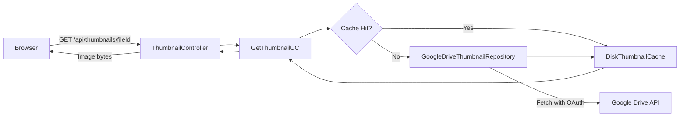

# Thumbnail Proxy with Disk Cache

## Overview

Implement a thumbnail proxy endpoint that fetches thumbnails from Google Drive API and caches them to disk. This reduces API calls, improves performance, and hides authentication from the frontend.

## Current State Analysis

### Existing Implementation
- **Domain Model**: [`DriveFile`](src/main/java/com/fde/google_drive_organizer/domain/model/DriveFile.java) contains `thumbnailLink` field (Google Drive URL)
- **Template**: [`filelist.html`](src/main/resources/templates/fragments/filelist.html:16) directly references `file.thumbnailLink()` in `` tags
- **Repository**: [`GoogleDriveFileRepository`](src/main/java/com/fde/google_drive_organizer/adapter/outbound/drive/GoogleDriveFileRepository.java:48) fetches `thumbnailLink` from Google Drive API
- **Authentication**: OAuth2 tokens managed by Spring Security via [`GoogleOAuth2AccessTokenProvider`](src/main/java/com/fde/google_drive_organizer/adapter/outbound/oauth/GoogleOAuth2AccessTokenProvider.java)

### Problem
- Direct thumbnail URLs from Google Drive require authentication
- No caching means repeated API calls for same thumbnails
- Browser cannot access thumbnails without proper OAuth tokens
- Rate limiting concerns with many files

## Solution Architecture

### High-Level Design



### Component Breakdown

#### 1. Domain Layer

**New Port Interface**: `ThumbnailRepository`
```java
public interface ThumbnailRepository {
    Optional<byte[]> getThumbnail(String fileId);
}
```

**New Use Case**: `GetThumbnailUC`
```java
public class GetThumbnailUC {
    private final ThumbnailRepository thumbnailRepository;
    
    public Optional<byte[]> execute(String fileId) {
        return thumbnailRepository.getThumbnail(fileId);
    }
}
```

#### 2. Application Layer

**Cache Configuration**
- Location: `cache/thumbnails/` directory (configurable)
- Naming: `{fileId}.jpg` or `{fileId}.png`
- Max size: Configurable (e.g., 500MB)
- TTL: Configurable (e.g., 7 days)
- Cleanup: LRU eviction when max size reached

#### 3. Adapter Layer - Outbound

**New Component**: `DiskThumbnailCache`
```java
@Component
public class DiskThumbnailCache {
    private final Path cacheDirectory;
    private final long maxCacheSizeBytes;
    private final Duration cacheTtl;
    
    public Optional<byte[]> get(String fileId);
    public void put(String fileId, byte[] thumbnailData);
    public void evictExpired();
    public void evictLru();
}
```

**New Component**: `GoogleDriveThumbnailRepository` (implements `ThumbnailRepository`)
```java
@Component
public class GoogleDriveThumbnailRepository implements ThumbnailRepository {
    private final DiskThumbnailCache cache;
    private final AccessTokenProvider accessTokenProvider;
    
    @Override
    public Optional<byte[]> getThumbnail(String fileId) {
        // 1. Check cache first
        Optional<byte[]> cached = cache.get(fileId);
        if (cached.isPresent()) {
            return cached;
        }
        
        // 2. Fetch from Google Drive API
        Optional<byte[]> thumbnail = fetchFromGoogleDrive(fileId);
        
        // 3. Cache if found
        thumbnail.ifPresent(data -> cache.put(fileId, data));
        
        return thumbnail;
    }
    
    private Optional<byte[]> fetchFromGoogleDrive(String fileId);
}
```

#### 4. Adapter Layer - Inbound

**New Controller**: `ThumbnailController`
```java
@RestController
@RequestMapping("/api/thumbnails")
public class ThumbnailController {
    private final GetThumbnailUC getThumbnailUC;
    
    @GetMapping("/{fileId}")
    public ResponseEntity<byte[]> getThumbnail(
            @PathVariable String fileId,
            @AuthenticationPrincipal OAuth2User user) {
        
        if (user == null) {
            return ResponseEntity.status(HttpStatus.UNAUTHORIZED).build();
        }
        
        return getThumbnailUC.execute(fileId)
            .map(bytes -> ResponseEntity.ok()
                .contentType(MediaType.IMAGE_JPEG)
                .cacheControl(CacheControl.maxAge(7, TimeUnit.DAYS))
                .body(bytes))
            .orElse(ResponseEntity.notFound().build());
    }
}
```

#### 5. Presentation Layer

**Update Template**: [`filelist.html`](src/main/resources/templates/fragments/filelist.html:16)

**Current**:
```html

```

**Updated**:
```html

```

## Configuration

### Application Properties

**File**: [`application.yaml`](src/main/resources/application.yaml)

```yaml
thumbnail:
  cache:
    directory: ${THUMBNAIL_CACHE_DIR:./cache/thumbnails}
    max-size-mb: ${THUMBNAIL_CACHE_MAX_SIZE_MB:500}
    ttl-days: ${THUMBNAIL_CACHE_TTL_DAYS:7}
    cleanup-interval-hours: ${THUMBNAIL_CACHE_CLEANUP_HOURS:24}
```

## Implementation Details

### Cache Storage Strategy

**Directory Structure**:
```
cache/
└── thumbnails/
    ├── {fileId1}.jpg
    ├── {fileId2}.png
    ├── {fileId3}.jpg
    └── .metadata.json  # Cache metadata for TTL and LRU
```

**Metadata Format** (`.metadata.json`):
```json
{
  "fileId1": {
    "lastAccessed": "2026-02-02T18:00:00Z",
    "created": "2026-02-01T10:00:00Z",
    "sizeBytes": 45678,
    "extension": "jpg"
  }
}
```

### Google Drive API Integration

**Fetching Thumbnail**:
```java
private Optional<byte[]> fetchFromGoogleDrive(String fileId) {
    try {
        Drive driveService = buildDriveService(accessToken);
        
        // Get file metadata to find thumbnail link
        File file = driveService.files().get(fileId)
            .setFields("thumbnailLink")
            .execute();
        
        if (file.getThumbnailLink() == null) {
            return Optional.empty();
        }
        
        // Fetch thumbnail image
        HttpResponse response = driveService.getRequestFactory()
            .buildGetRequest(new GenericUrl(file.getThumbnailLink()))
            .execute();
        
        return Optional.of(response.getContent().readAllBytes());
        
    } catch (IOException e) {
        log.warn("Failed to fetch thumbnail for file {}: {}", fileId, e.getMessage());
        return Optional.empty();
    }
}
```

### Cache Eviction Strategy

**LRU Eviction**:
1. Track last access time in metadata
2. When cache size exceeds max, sort by last accessed
3. Remove oldest entries until under threshold

**TTL Eviction**:
1. Scheduled task runs every N hours
2. Check created timestamp against TTL
3. Delete expired entries and update metadata

**Implementation**:
```java
@Scheduled(fixedRateString = "${thumbnail.cache.cleanup-interval-hours}", timeUnit = TimeUnit.HOURS)
public void cleanupExpiredThumbnails() {
    Instant cutoff = Instant.now().minus(cacheTtl);
    
    metadata.entrySet().removeIf(entry -> {
        if (entry.getValue().created().isBefore(cutoff)) {
            deleteThumbnailFile(entry.getKey());
            return true;
        }
        return false;
    });
    
    saveMetadata();
}
```

### Error Handling

**Scenarios**:
1. **File not found**: Return 404
2. **No thumbnail available**: Return 404 or fallback icon
3. **API rate limit**: Return cached version or 503
4. **Disk full**: Evict LRU entries, log warning
5. **Invalid file ID**: Return 400

**Fallback Strategy**:
```java
public ResponseEntity<byte[]> getThumbnail(@PathVariable String fileId) {
    return getThumbnailUC.execute(fileId)
        .map(bytes -> ResponseEntity.ok()
            .contentType(MediaType.IMAGE_JPEG)
            .body(bytes))
        .orElseGet(() -> {
            // Fallback to icon if no thumbnail
            byte[] fallbackIcon = loadFallbackIcon();
            return ResponseEntity.ok()
                .contentType(MediaType.IMAGE_PNG)
                .body(fallbackIcon);
        });
}
```

## Benefits

✅ **Reduced API Calls**: Thumbnails fetched once, cached for 7 days
✅ **Better Performance**: Disk cache faster than API calls
✅ **Authentication Hidden**: Backend handles OAuth tokens
✅ **Rate Limit Protection**: Cache prevents repeated API calls
✅ **Browser Caching**: HTTP cache headers reduce network traffic
✅ **Lazy Loading**: `loading="lazy"` attribute defers off-screen images
✅ **Scalability**: Configurable cache size and TTL

## Drawbacks

❌ **Initial Load**: First page load still makes N API calls
❌ **Disk Space**: Requires storage for cached thumbnails
❌ **Complexity**: More code to maintain (cache management)
❌ **Stale Data**: Thumbnails may be outdated if file changes

## Testing Strategy

### Unit Tests

1. **`GetThumbnailUCTest`**
   - Should return thumbnail from repository
   - Should handle missing thumbnail

2. **`DiskThumbnailCacheTest`**
   - Should cache and retrieve thumbnails
   - Should evict expired entries
   - Should evict LRU when max size exceeded
   - Should handle disk I/O errors

3. **`GoogleDriveThumbnailRepositoryTest`**
   - Should check cache before API call
   - Should fetch from API when cache miss
   - Should cache fetched thumbnails
   - Should handle API errors gracefully

4. **`ThumbnailControllerTest`**
   - Should return thumbnail for authenticated user
   - Should return 401 for unauthenticated user
   - Should return 404 when thumbnail not found
   - Should set proper cache headers

### Integration Tests

1. **End-to-End Flow**
   - Fetch thumbnail via controller
   - Verify cache is populated
   - Second request served from cache
   - Verify no second API call

2. **Cache Eviction**
   - Fill cache to max size
   - Verify LRU eviction works
   - Verify TTL eviction works

## Implementation Steps

### Phase 1: Core Infrastructure
1. Create `ThumbnailRepository` port interface
2. Create `GetThumbnailUC` use case
3. Implement `DiskThumbnailCache` component
4. Add cache configuration to `application.yaml`
5. Write unit tests for cache component

### Phase 2: Google Drive Integration
6. Implement `GoogleDriveThumbnailRepository`
7. Add thumbnail fetching logic with OAuth
8. Integrate cache with repository
9. Write unit tests for repository

### Phase 3: HTTP Endpoint
10. Create `ThumbnailController`
11. Add authentication check
12. Add proper HTTP headers (content-type, cache-control)
13. Write controller tests

### Phase 4: Frontend Integration
14. Update [`filelist.html`](src/main/resources/templates/fragments/filelist.html) to use proxy endpoint
15. Add `loading="lazy"` for performance
16. Test with browser

### Phase 5: Cache Management
17. Implement scheduled cleanup task
18. Add LRU eviction logic
19. Add TTL eviction logic
20. Test eviction strategies

### Phase 6: Error Handling & Polish
21. Add fallback icon for missing thumbnails
22. Add comprehensive error handling
23. Add logging for monitoring
24. Performance testing

## File Structure

```
src/main/java/com/fde/google_drive_organizer/
├── domain/
│   ├── model/
│   │   └── DriveFile.java (existing)
│   └── port/
│       └── outbound/
│           ├── FileRepository.java (existing)
│           └── ThumbnailRepository.java (NEW)
├── application/
│   └── usecase/
│       ├── ListDriveFilesUC.java (existing)
│       └── GetThumbnailUC.java (NEW)
└── adapter/
    ├── inbound/
    │   └── http/
    │       ├── FileListController.java (existing)
    │       └── ThumbnailController.java (NEW)
    └── outbound/
        ├── drive/
        │   ├── GoogleDriveFileRepository.java (existing)
        │   ├── GoogleDriveThumbnailRepository.java (NEW)
        │   └── AccessTokenProvider.java (existing)
        └── cache/
            └── DiskThumbnailCache.java (NEW)

src/main/resources/
├── application.yaml (UPDATE)
└── templates/
    └── fragments/
        └── filelist.html (UPDATE)

src/test/java/com/fde/google_drive_organizer/
├── application/
│   └── usecase/
│       └── GetThumbnailUCTest.java (NEW)
└── adapter/
    ├── inbound/
    │   └── http/
    │       └── ThumbnailControllerTest.java (NEW)
    └── outbound/
        ├── drive/
        │   └── GoogleDriveThumbnailRepositoryTest.java (NEW)
        └── cache/
            └── DiskThumbnailCacheTest.java (NEW)
```

## Dependencies

No new dependencies required. Existing dependencies cover all needs:
- Spring Boot Web (for REST controller)
- Google Drive API (for thumbnail fetching)
- Spring Security OAuth2 (for authentication)

## Future Enhancements

1. **Redis Cache**: Replace disk cache with Redis for distributed systems
2. **Image Optimization**: Resize/compress thumbnails before caching
3. **CDN Integration**: Serve cached thumbnails from CDN
4. **Batch Prefetch**: Prefetch thumbnails for visible files
5. **Progressive Loading**: Show low-res placeholder while loading
6. **Cache Warming**: Pre-populate cache on startup
7. **Metrics**: Track cache hit rate, API call count
8. **Admin API**: Endpoints to clear cache, view stats

## Security Considerations

1. **Authentication Required**: Only authenticated users can access thumbnails
2. **File ID Validation**: Validate file ID format to prevent path traversal
3. **Rate Limiting**: Consider rate limiting thumbnail endpoint
4. **Access Control**: Verify user has access to requested file (future enhancement)
5. **Cache Isolation**: Consider per-user cache directories for multi-tenant scenarios

## Performance Metrics

**Expected Improvements**:
- First load: N API calls (same as current)
- Subsequent loads: 0 API calls (100% cache hit)
- Response time: ~5-10ms (disk cache) vs ~200-500ms (API call)
- Bandwidth savings: ~90% reduction after initial load

**Monitoring**:
- Cache hit rate
- Cache size
- API call count
- Average response time
- Eviction frequency
